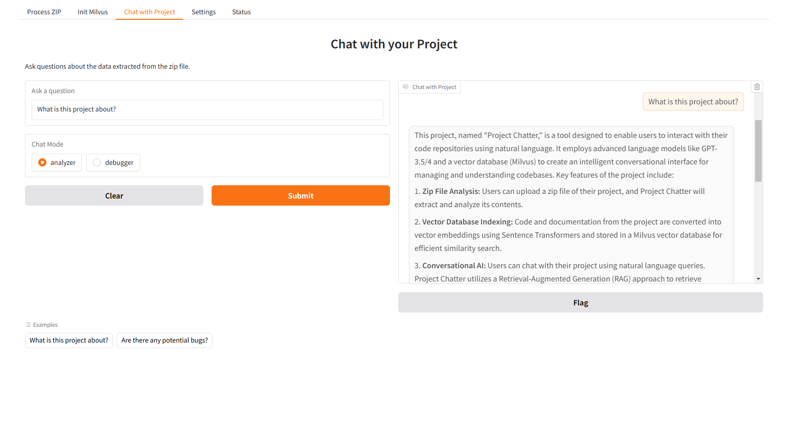
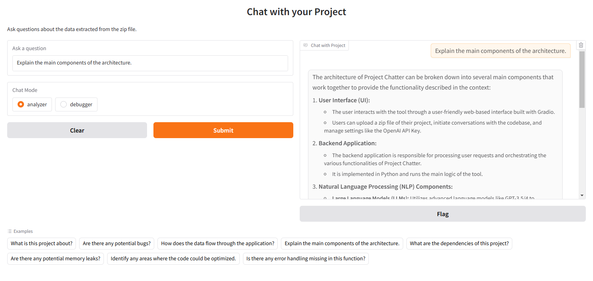
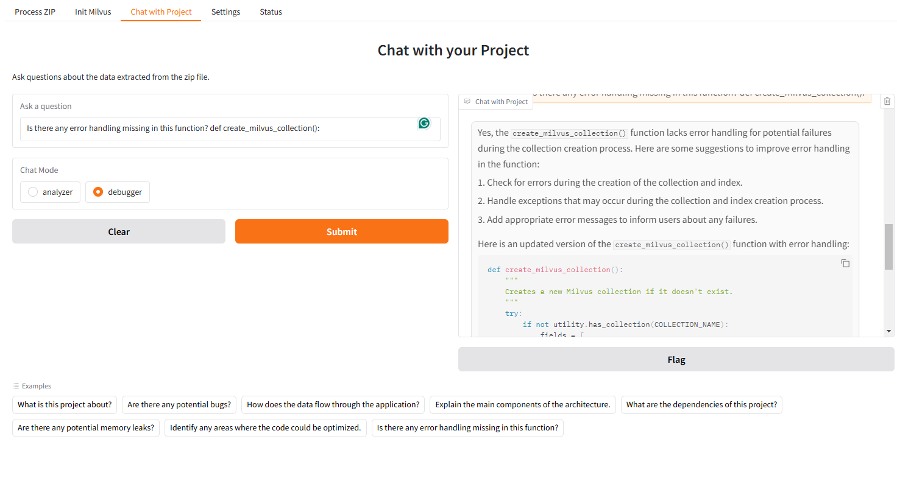

# Project Chatter: Chat with Your Codebase

## Overview

Project Chatter is a powerful tool that allows you to interact with your code repositories using natural language. It leverages the capabilities of large language models (LLMs) like GPT-3.5/4, combined with a vector database (Milvus), to provide an intelligent conversational interface for your projects.

**Key Features:**

*   **Zip File Analysis:** Upload a zip file of your project, and Project Chatter will extract and analyze its contents.
*   **Vector Database Indexing:** The project's code and documentation are converted into vector embeddings using Sentence Transformers and stored in a Milvus vector database for efficient similarity search.
*   **Conversational AI:** Chat with your project using natural language queries. Project Chatter uses a Retrieval-Augmented Generation (RAG) approach to retrieve relevant code snippets and generate insightful responses.
*   **Two Chat Modes:**
    *   **Analyzer:** Understand the overall structure, purpose, and functionality of your project.
    *   **Debugger:** Identify potential bugs, errors, and areas for improvement. Get suggestions for fixes and even corrected code snippets.
*   **Secure API Key Management:** Store your OpenAI API key securely in a `.env` file or enter it directly through the web interface.
*   **User-Friendly Interface:** Built with Gradio, providing an intuitive and interactive web-based UI.

## Installation

1.  **Prerequisites:**
    *   Python 3.12 or higher
    *   Milvus Vector Database (Follow the [official Milvus installation guide](https://milvus.io/docs/install_standalone-docker.md) to set up a Milvus instance.)

2.  **Clone the repository:**

    ```bash
    https://github.com/ruslanmv/Project-Chatter.git
    cd Project-Chatter
    ```

3.  **Install dependencies:**

    ```bash
    pip install -r requirements.txt
    ```

    (Create a `requirements.txt` file with the following content)

    ```
    gradio
    pymilvus
    sentence-transformers
    openai
    langchain
    python-dotenv
    langchain-community
    langchain_openai
    ```

4.  **Set up your OpenAI API Key:**

    *   **Option 1: Using a `.env` file (Recommended):**
        *   Create a file named `.env` in the project root directory.
        *   Add the following line to your `.env` file:
            ```
            OPENAI_API_KEY=your_openai_api_key
            ```
            Replace `your_openai_api_key` with your actual API key.
    *   **Option 2: Through the Web Interface:**
        *   You can enter your API key directly in the "Settings" tab of the Project Chatter web application. The key will be saved to the `.env` file.

## Usage

1.  **Start the application:**

    ```bash
    python app.py
    ```

2.  **Access the web interface:**

    Open your web browser and go to `http://127.0.0.1:7860` (or the URL indicated in your terminal).

3.  **Project Chatter Interface:**

    *   **Process ZIP:** Upload a zip file of your project. The application will extract it, analyze the contents, and create vector embeddings.
    *   **Init Milvus:** Initialize the Milvus vector database. This step loads the embeddings into Milvus for efficient searching.
    *   **Chat with Project:**
        *   Select a chat mode: "Analyzer" or "Debugger."
        *   Enter your query in the chatbox and press Enter.
        *   Project Chatter will retrieve relevant code snippets and generate a response using the selected mode's prompt.
    *   **Settings:** Enter or update your OpenAI API key (if not already set in the `.env` file).
    *   **Status:** View the current status of your OpenAI API key.

## Example Queries

**Analyzer Mode:**

*   "What is the purpose of this project?"
*   "How does the data flow through the application?"
*   "Explain the main components of the architecture."
*   "What are the dependencies of this project?"

## Example



**Debugger Mode:**

*   "Are there any potential memory leaks?"
*   "Identify any areas where the code could be optimized."
*   "Is there any error handling missing in this function?"
*   "How can I fix this specific bug?" (Provide context or code snippets)


## Example


## Contributing

Contributions are welcome! If you have suggestions, bug reports, or want to contribute code, please feel free to open an issue or submit a pull request.

## License

This project is licensed under the [MIT License](LICENSE) (You'll need to add a LICENSE file).

## Credits

Developed by [Ruslan Magana Vsevolodovna](https://ruslanmv.com/)

## Disclaimer

Project Chatter is an experimental tool and may not be suitable for all projects or use cases. The quality of the generated responses depends heavily on the quality of the code, documentation, and the capabilities of the underlying language model. Use it responsibly and always verify the generated information.